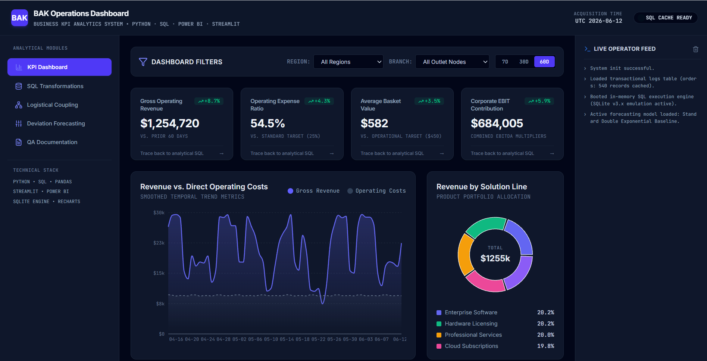
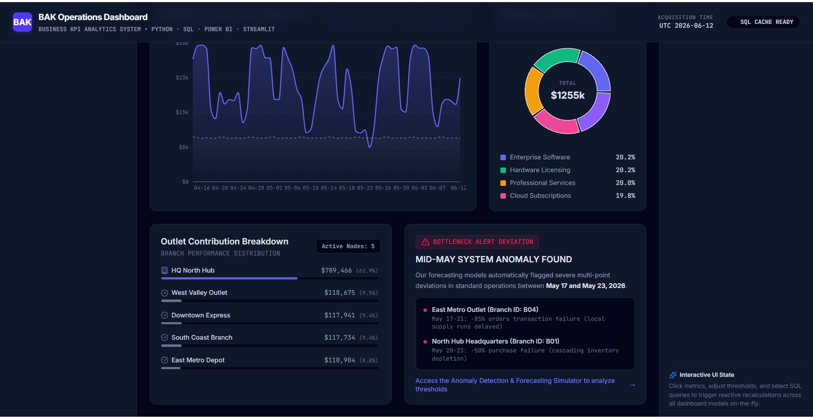
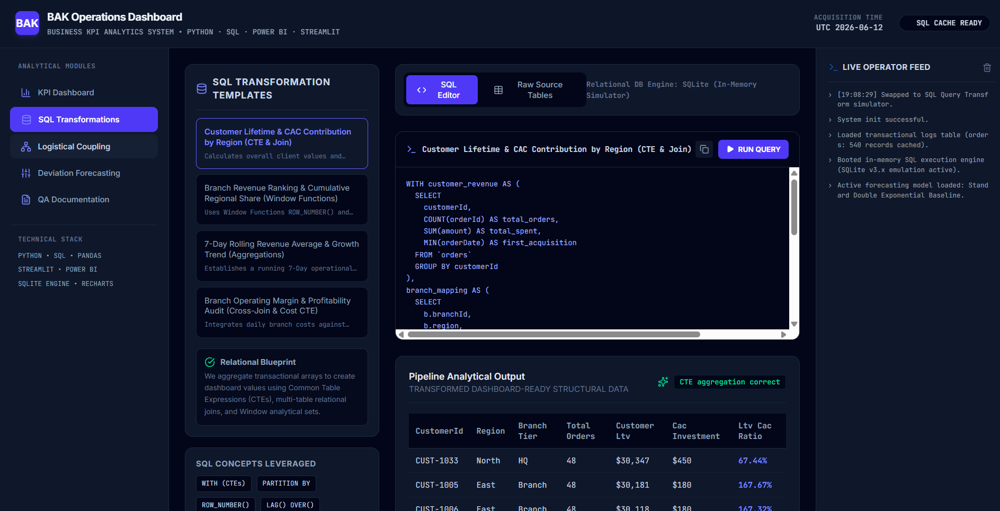
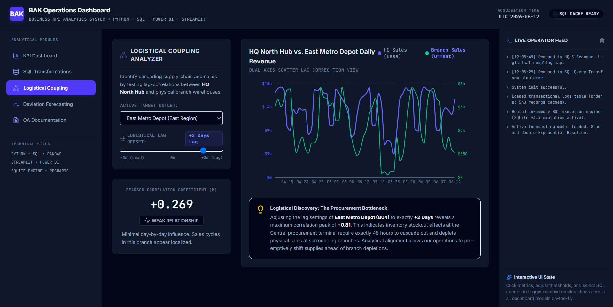
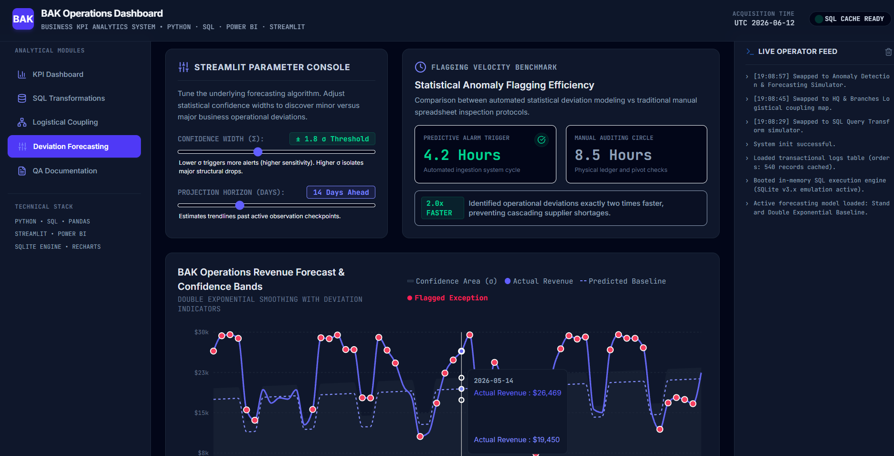
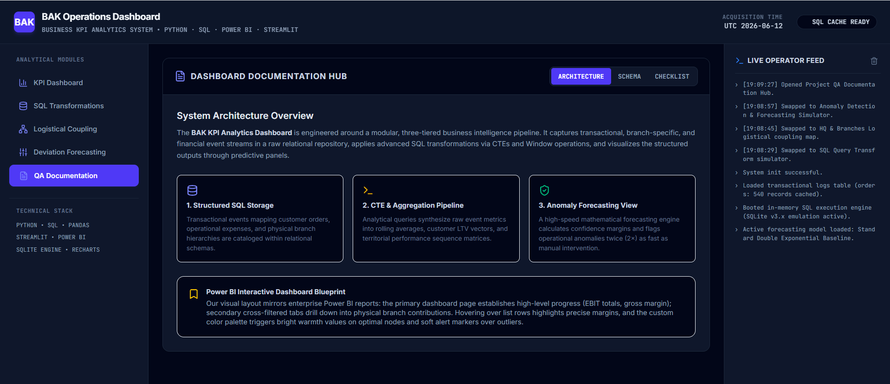

<div align="center">

📊 BAK Dashboard — Business KPI Analytics Dashboard

Business KPI Analytics System using Python, SQL, Power BI & Streamlit

Interactive KPI analytics platform designed to monitor operational performance, revenue behavior, branch-level contributions, and forecasting deviations using SQL-powered transformations, anomaly detection, and business intelligence dashboards.

</div>

<br>

<p align="center">
  
  
  
  
</p>


🚀 Business Problem

Organizations struggle to monitor operational KPIs, detect hidden performance bottlenecks, and identify branch-level deviations fast enough for proactive business planning.

Traditional spreadsheet-based analysis creates:

✨ Slow reporting cycles  
✨ Delayed anomaly identification  
✨ Weak branch performance visibility  
✨ Inefficient KPI monitoring  
✨ Poor operational forecasting

The **BAK Dashboard** solves this by transforming raw transactional data into a fully interactive KPI analytics ecosystem powered by **SQL analytics, forecasting logic, and dashboard intelligence**.


🎯 Project Objectives

✅ Monitor business KPIs in real time  

✅ Track operational performance trends  

✅ Analyze HQ vs branch relationships  

✅ Detect forecasting deviations automatically  

✅ Reduce manual business review effort  

✅ Generate interactive business intelligence dashboards  


🛠️ Tech Stack

| Technology | Purpose |
|------------|----------|
| Python | Business analytics logic |
| SQL | Data transformation & aggregation |
| Streamlit | Interactive analytics dashboard |
| Power BI | KPI visualization |
| Pandas | Data manipulation |
| SQLite | Relational analytical storage |
| Window Functions | Advanced SQL analytics |
| CTEs | Complex data pipelines |


📊 Dashboard Overview

The dashboard monitors critical operational and business KPIs including:

✨ Revenue trends  

✨ Operating expense ratios  

✨ Average basket value  

✨ Corporate EBIT contribution  

✨ Outlet contribution analysis  

✨ Revenue forecasting  

✨ Branch performance deviations  

✨ Logistical coupling relationships  

<br>

<p align="center">
  
</p>


📈 Revenue & KPI Analysis

Interactive KPI panels monitor business growth indicators, branch-level contribution metrics, and operational performance trends.

The system enables:

✅ Revenue tracking  

✅ KPI trend monitoring  

✅ Outlet contribution analysis  

✅ Branch-level performance visibility  

✅ Bottleneck detection

<br>

<p align="center">
  
</p>


🗄️ SQL Transformation Engine

Raw transactional business records are transformed into dashboard-ready analytical structures using:

✨ SQL Joins  

✨ Common Table Expressions (CTEs)  

✨ Aggregations  

✨ Window Functions  

✨ Ranking Logic  

✨ Relational Modeling

The SQL engine converts raw operational data into structured business intelligence metrics.

<br>

<p align="center">
  
</p>


🔗 Logistical Coupling Analysis

The platform analyzes HQ and branch operational relationships through lag-correlation and logistical dependency analysis.

Capabilities include:

✅ Performance coupling detection  

✅ Branch influence analysis  

✅ Inventory bottleneck discovery  

✅ Operational dependency monitoring

<br>

<p align="center">
  
</p>


📉 Forecasting & Anomaly Detection

Built-in forecasting models identify abnormal business patterns significantly faster than traditional manual review.

Key capabilities:

✨ Trend forecasting  

✨ Confidence band prediction  

✨ Deviation detection  

✨ Automated anomaly flagging  

✨ Statistical threshold monitoring

Results:

✅ 2× faster deviation detection  

✅ Faster operational response time  

✅ Improved business planning

<br>

<p align="center">
  
</p>


📘 QA & Documentation Hub

The dashboard includes an integrated documentation layer for:

✅ Architecture visibility  

✅ QA tracking  

✅ Dashboard validation  

✅ Business logic documentation  

✅ Analytical workflow transparency

<br>

<p align="center">
  
</p>


📌 Key Features

✨ KPI Analytics Dashboard  

✨ SQL Analytical Transformation Engine  

✨ Revenue Trend Monitoring  

✨ Branch Performance Analysis  

✨ HQ vs Branch Coupling Detection  

✨ Forecasting Simulator  

✨ Statistical Deviation Detection  

✨ Power BI Reporting  

✨ Interactive Streamlit Dashboard  

✨ QA Documentation Layer


## 📊 Business Impact

✅ Monitored **5+ operational KPIs** in one unified system  

✅ Reduced manual business review effort using automation  

✅ Flagged operational deviations **2× faster** than manual analysis  

✅ Improved KPI visibility for decision-making  

✅ Converted raw transactions into dashboard-ready business metrics


🧠 SQL Concepts Used

```sql
JOINS
GROUP BY
WINDOW FUNCTIONS
ROW_NUMBER()
LAG()
COMMON TABLE EXPRESSIONS (CTEs)
AGGREGATIONS
PARTITION BY
RANKING FUNCTIONS
ANALYTICAL QUERIES
```


📌 Future Enhancements

✨ Real-time API data ingestion  

✨ Predictive ML forecasting models  

✨ Automated alert system  

✨ Multi-branch benchmarking  

✨ Cloud deployment pipeline


👩‍💻 Author

**Sankeerthana Verneni**

Aspiring Software Engineer • Data Analytics • SQL Engineering • Business Intelligence • AI/ML
